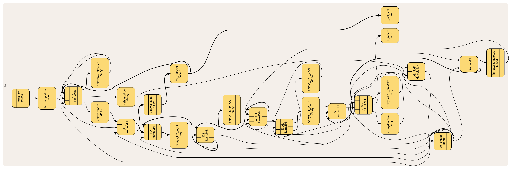

# APSA-to-MAPE
APSA-to-MAPE

This repository contains two main components used to simulate and execute an APSA-based smart home system.
The workflow consists of running a home environment simulation first, and then running the APSA model implemented in ForSyDe/SADF.

📁 Folder Structure
1. sinergym/

This folder contains the smart-home environment simulation.
The environment is executed using Docker and provides the external signals and conditions required by the APSA model.

2. ForSyDe-systemC-SmartHome/

This folder contains the implementation of the APSA smart home using ForSyDe::SADF (SystemC).
The model interacts with the environment and generates APSA-based decisions.

🔧 Running the Environment (Sinergym)

To start the home simulation environment, run the following command:

docker run --rm -v "$PWD":/app -w /app -p 9000:9000 sinergym:latest python3 -u environment.py

This will launch the simulation on port 9000, using your current directory as /app inside the container.

⚙️ Running the APSA Model (ForSyDe/SADF)

After the environment is running, to compile the model must have the systemc and the ForSyDe library. to be able to do that pull the docker image:

Pulling the image : docker pull maryamsam/ubuntu-systemc-forsyde:24.04

Entering te container : docker run -it maryamsam/ubuntu-systemc-forsyde:24.04

Compile the APSA SystemC model:
g++ -std=c++17 main.cpp -o output -I$FORSYDE_HOME/src  -lsystemc

Notes:
The -lsystemc flag links the SystemC library.

To run the compiled model:  ./output

▶️ Execution Order

Start the Sinergym environment

python3 environment.py   # (inside Docker as shown above)

Compile and run the APSA model
./output

The APSA model expects the environment to be running first, as it reads input values produced by the simulation.

 ForSyDe-systemC-SmartHome model :
 

